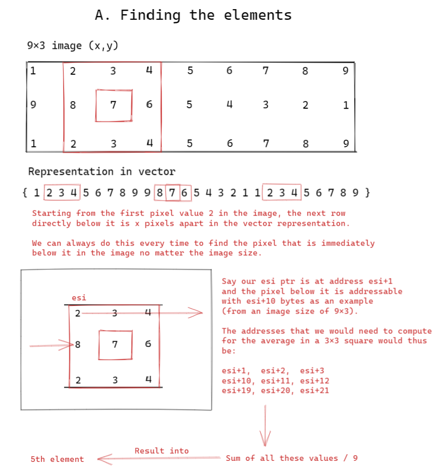
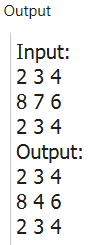

# LBYARCH-x86-32-Average-Filtering

**DRAFT: Performing an avergae filtering on an image**

 (*simplified: no traversal*)


``` asm
%include "io.inc"
section .data
vector dw 1, 2, 3, 4, 5, 6, 7, 8, 9, 9, 8, 7, 6, 5, 4, 3, 2, 1, 1, 2, 3, 4, 5, 6, 7, 8, 9 
x_size dd 9
y_size dd 3
divisor db 9
section .text
global main
main:                       ; note: Im using word size for the vector so esi+1 becomes esi+2 for this example
    lea ESI, [vector]       ; reader
    
    mov EBX, [x_size]
    imul EBX, 2             ; size word
    
    lea EDI, [vector]       ; writer
    add EDI, 4              ; move EDI to middle of top row
    add EDI, EBX            ; EDI is now at middle of the 3x3
    
    PRINT_STRING "Input:"
    NEWLINE
    mov ECX, 3              ; loop handler
    mov DX, 0               ; sum collector
L1:                         ; Read elements from the vector in a 3x3 box
    mov AX, [ESI+2]
    add DX, AX
    PRINT_DEC 2, AX
    PRINT_CHAR 32
    mov AX, [ESI+4]
    add DX, AX
    PRINT_DEC 2, AX
    PRINT_CHAR 32
    mov AX, [ESI+6]
    add DX, AX
    PRINT_DEC 2, AX
    NEWLINE
    
    add ESI, EBX
    dec ECX
    jnz L1
    
    ; SUM/9
    mov AX, DX
    mov DL, [divisor]
    DIV DL
    
    mov [EDI], AL               ; Result into EDI
    
    PRINT_STRING "Output:"
    NEWLINE
    mov ECX, 3
    lea ESI, [vector]           ; reload reader
L2:
    mov AX, [ESI+2]
    add DX, AX
    PRINT_DEC 2, AX
    PRINT_CHAR 32
    mov AX, [ESI+4]
    add DX, AX
    PRINT_DEC 2, AX
    PRINT_CHAR 32
    mov AX, [ESI+6]
    add DX, AX
    PRINT_DEC 2, AX
    NEWLINE
    
    add ESI, EBX
    dec ECX
    jnz L2
    
    xor eax, eax
    ret
```



**Assembling, Compiling, and Linking**
```
nasm -f win32 imgAvgFilter.asm

gcc -c main.c -o main.obj -m32

gcc main.obj imgAvgFilter.obj -o imgAvgFilter.exe -m32

imgAvgFilter.exe
```
